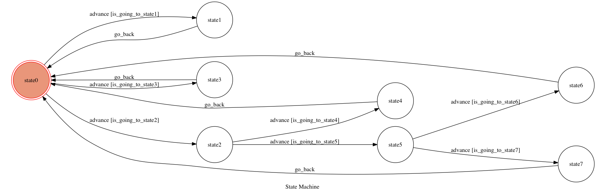

# TOC Project 2017

## Finite State Machine

## 用法
一開始是stage0，可選三種輸入，分別是cavalier will win nba finals，warrior will win nba finals，i don't care who win nba finals，若選cavalier will win nba finals會進入stage1，回答right後，回到stage0，選i don't care who win nba finals會進入stage3，回答ok後，回到stage0，選warrior will win nba finals，會進入stage2，回答but cavalier has lebron james.\n so you think which team will win nba finals
在來有兩種選擇，分別是cavalier will win nba finals和warrior will win nba finals，選cavalier will win nba finals，會進入stage4，回答right後，回到stage0，選warrior will win nba finals，進入stage5，回答but cavalier has kyrie irving.\n so you think which team will win nba finals
接下來仍然是兩種選擇，仍然是cavalier will win nba finals和warrior will win nba finals，選cavalier will win nba finals，會進入stage6，回答right後，回到stage0，選warrior will win nba finals，進入stage7，回答i can't convince you'

## Author
戴宇
